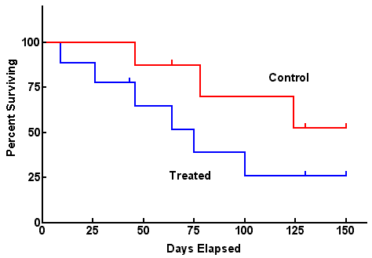
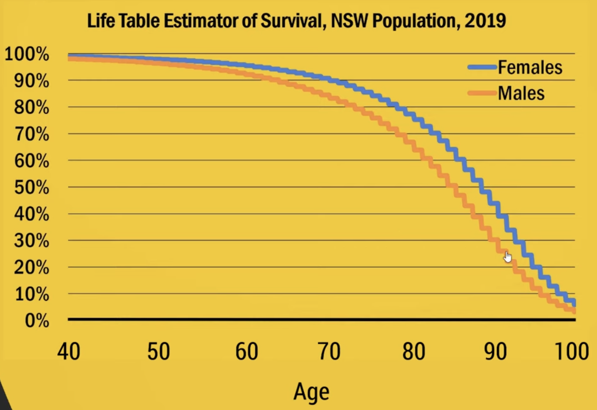
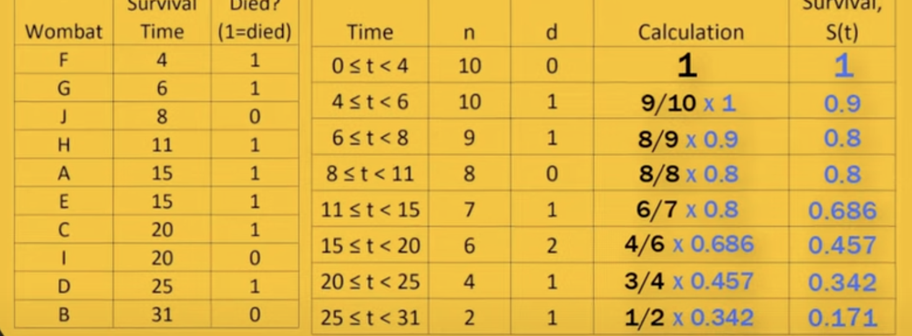
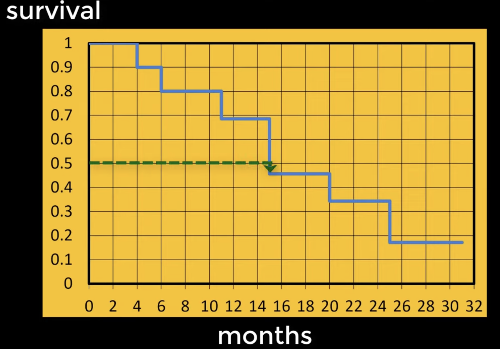

\tableofcontents  

```{r setup, include=FALSE}
knitr::opts_chunk$set(echo = TRUE)
```

\newpage 
# Introduction 
## Definitions 

The **Survival analysis** also known as time to event analysis is used to predict the time until an event occurs.

Most important concepts for this analysis: 

+ **Exposure** (clock starts), time zero of the analysis for this subject.
+ **Event** (clock stops), 
+ **Survival time**, (difference between time of Event and time of Exposure).

A Survival time can be estimated in this examples:     

+ Exposure (Cancer diagnostic), Event (Death )
+ Exposure (Marriage), Event (Divorce)   

## Equation 

Y = time-to-event 

Where the Y = outcome, depends on $Time$ and on the $Event$ (0 = NO, 1 = YES) : 

+ 0 : the event didn't occured 
+ 1 : the event occured 


\newpage
 
# Survival function, Hazard & Hazard ratio
## The Survival function/Model

survival function $S(t) = P(T>t)$ = Probability of Survival **beyond time t**.

## Hazard  

$Hazard(Haz) = P(T<t +d\:|\: T> t)$ = probability of dying in the next few seconds **given alive now**.

For the Exponential survival model, the hazard function correspond to the rate of the exponential curve.

## Hazard  Ratio

$Hazard\:(HR) = \frac{Haz, x=1}{Haz, x = 0}$ = relative ratio, 

At a given instant in time someone who is exposed is "relative ration" times more important to someone who is not.


## Different models

Two type of functions/models to illustrate the decrease in survival probability.

S(t) is the survival function

+ **Kaplan-Meier survival model**  (non-parametric)
  + Pros : Simple to interpret, can estimate S(t)
  + Cons : No functional form (no mathematical function, because of steps), can not estimate hazard ratio  
  
+ **Exponential survival model ** (parametric) 
  + Pros : Can estimate the S(t), and Hazard ratio 
  + Cons : Not always realistic, because assumes constant hazard ( death is not constant ) 

+ **Cox proportional Hazard model** (semi-parametric), sort of a combination of KM model and Exponential model
  + Pros : Haz can fluctuate with time, Can estimate Hazard ratio
  + Cons : Can not estimate S(t)

\newpage
 
## Kaplan-Meier survival model

Also known as Product-Limit Method, or the life table method. 

This is a non-parametric curve, explains the selected data. The ticks are censored data 

{.class width=100% height=100%}

## More examples of use 

In Health, Time to: 

+ Death 
+ Device failure 
+ Re-admission 

In industry, Time to:

+ Component failure
+ Business failure 
+ staff promotion 

In marriage, Time to:

+ Divorce 
+ Second child 

\newpage 

# Censoring and truncation 

## Definitions

**Censoring** : Censoring occurs when we don't know the exact time-to-event for an included observation. Lack of some part of the information. 

There are 3 different types of censoring :  

+ Right censoring (time to event greater than a value), this type of censoring could sometimes be informative when the censoring is actually correlated to the expected event (consequence).
+ Left censoring (time to event less than a value)
+ Interval censoring ( time to event between two values)

An example of right censoring is a time-to-event that continues after the experiment ( patient that is still alive a the end of the study).


**Truncation** : Truncation occurs when observation are excluded by virtue of their time-to-event. Short or Long time events that where not measured.

There are 2 different types of truncation :

+ left truncation ( short time-to-event values, small values that where not measured )
+ right truncation ( long time-to-event values, large values that where not measured )

The whole data set can be truncated, whereas data points can be censored.

\newpage 

# Kaplan Meier Model in R 

```{r, echo=TRUE, message=FALSE}

rm(list = ls())

library(tidyverse)
library(survival)

time   <- c(2,4,6,8,11,15,16,18,18,20,22,22,25,27,28,32,32,34,34)
death  <- c(1,1,0,1,1,1,1,0,0,1,0,1,1,1,1,0,1,0,0) # Censoring or not, 1 = died, 0 = censored 
over40 <- c(1,1,0,1,1,1,1,0,0,1,0,1,0,1,1,0,1,1,0)   # Is over 40 or not, 1 = YES, 0 = NO 

df <- tibble(time,death,over40)

```

## Kaplan Meier Model with no X variable 

## Summary 

```{r}

# We use ~1 when there is no X variable ( additional categorical variable )
km.model <- survfit(Surv(time = time, event = death) ~ 1, 
                    type = "kaplan-meier")  # Kaplan-Meier is the default value 

km.model

```

To visualize the survival at specific time, and confidence intervals.

```{r}

summary(km.model)

```


## Kaplan-Meier curve

```{r}
plot(
  km.model,    # used model 
  conf.int = T,   # include confidence intervals 
  xlab = "Time (months)", 
  ylab = "% Alive = S(t)",
  main = "KM-Model",
  las = 1,       # rotatates the values on the y axis for better readability 
  mark.time = T  # adds the censored values to the graph as a tick
  )

abline(h = 0.5, col = "red")
```

\newpage

## Kaplan-Meier model with an X variable

## Summary 

```{r}

# We use ~1 when there is no X variable ( additional categorical variable )
km.model2 <- survfit(Surv(time = time, event = death) ~ over40, 
                    type = "kaplan-meier")  # Kaplan-Meier is the default value 

km.model2 

```

To visualize the survival at specific time, and confidence intervals.

```{r}

summary(km.model2)

```


## Kaplan-Meier curve with an X variable 

```{r}

plot(
  km.model2,    # used model 
  conf.int = F,   # include confidence intervals 
  xlab = "Time (months)", 
  ylab = "% Alive = S(t)",
  main = "KM-Model",
  col = c("red","blue"),   # add colors to the plots
  lwd = 2,       # makes the line a bit more thick
  las = 1,       # rotatates the values on the y axis for better readability 
  mark.time = T  # adds the censored values to the graph as a tick
  )

legend(26,    # x coordinate for the box
       1,     # y coordinate for the box
       legend = c("under40","over40"),  # Names for the legend 
       lty = 1, # linetype
       lwd = 2, # linewidth
       col = c("red","blue"), 
       bty = "",  # boxtype shape
       cex = 1    # boxfont size
       )

```

## The LOG-RANK-TEST

The logrank test assesses whether the KM survival curves from two subpopulation are significantly different.
Comparing the survival curves to see if they are different.

$H_0$: surivival in two groups is **the same**.
$H_1$: survival in the two groups is  **not the same**.


```{r}

survdiff(Surv(time,death)~ over40) # This can work with also more than 2 levels ( )

```

## Exemple of plot with ggplot2

```{r}

km.model2 <- survfit(Surv(time = time, event = death) ~ over40, 
                    type = "kaplan-meier")  # Kaplan-Meier is the default value 

p <- survminer::ggsurvplot(fit = km.model2,data = df)

p

```


 
\newpage 

# Life tables 

## Definitions

Life tables illustrate the pattern of survivorship of a population by considering the probability of death at each consecutive age. 

{.class width=100% height=100%}
Input : 

+ population by age group
+ deaths in each age group

Output : 

+ the survival functions at each age 
+ conditional life expectancy at each age ( probability of being alive)
+ median, mean quantile survival

\newpage 

# Kaplan-Meier Curves and Log-rank Test

## Calculating the steps 
 
It's a **non-parametric** estimator of survival.
Doesn't have an estimator ( like the mean or the standard deviation for an normal distribution ). A Kaplan-Meier curve looks more like steps than a curve, and doesn't use parameters, it represents the data.

{.class width=75% height=75%}

{.class width=75% height=75%}


